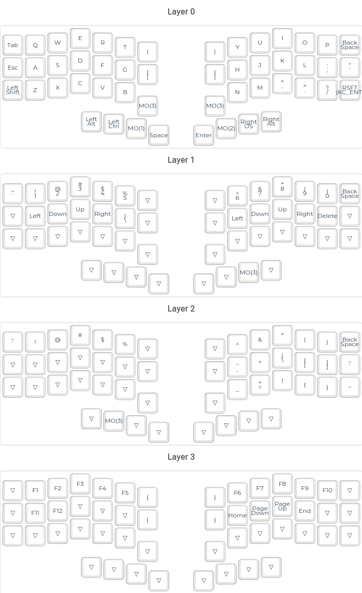

# Pinky3

Pinky3 fork with rotary encoders and kailh hotswaps for thumb row.
This is a WIP, but it's already works great for daily use.

No top/bottom plates are currently available for this board, but it works nice without them.

## Layout

## Firmware

Copy the contents of keymap directory in your qmk/keyboards/pinky/3/keymaps

## TODOs

- [ ] Full choc hotswap support
- [ ] Rework of top, bottom plates, screw holes position.
- [ ] Led strip support
- [ ] Renaming keyboard
- [ ] Build guides, bom, etc.
